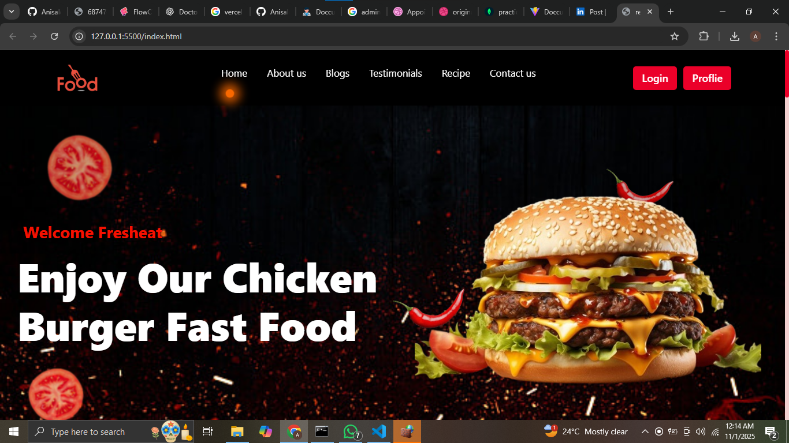

# 🍽️ Recipe Website

A modern and interactive **Recipe Website** built using **HTML, CSS, JavaScript, Firebase, and GSAP Animations**.  
This project allows users to explore, create, and manage recipes with smooth transitions, animations, and secure authentication.

---

## 🚀 Project Overview

The Recipe Website provides a seamless experience for users to view, search, and manage recipes.  
With Firebase integration for authentication and Firestore for data storage, it ensures a dynamic and real-time user experience.  
Admins can also manage and moderate recipes through an intuitive dashboard.

Built with performance, security, and design in mind — this project delivers both functionality and creativity.

---

## 🛠️ Tech Stack

| Layer | Technology |
|-------|-------------|
| Frontend | HTML, CSS, JavaScript |
| Animations | GSAP (GreenSock Animation Platform) |
| Backend & Database | Firebase Firestore |
| Authentication | Firebase Auth |
| Hosting | Firebase Hosting |

---

## 🔑 Key Features

✅ User Authentication (Google Sign-In & Password Reset)  
✅ Recipe Management (Create, Update, Delete)  
✅ Search & Filters (Search by name & category)  
✅ Favorite Recipes (Save your favorite recipes)  
✅ User Profile Customization (Update name, profile picture)  
✅ Admin Panel for Recipe Moderation  
✅ Pagination for a smooth user experience  
✅ Fully Animated Home Page 🎨  
✅ Sliders on all pages & Cursor Animations 🖱️  
✅ Logout Button Instead of Login (when authenticated)

---

## 🧑‍🍳 Screenshots

### 🏠 Home Page  
> 

### 🧑‍⚕️ Admin Panel  
> 

---

## 📊 Folder Structure

```
recipe-website/
┣ 📂 assets/                # Images, icons, styles
┃ ┗ 📜 styles.css
┣ 📂 js/                    # Scripts
┃ ┣ 📜 app.js
┃ ┣ 📜 firebase-config.js
┃ ┗ 📜 gsap-animations.js
┣ 📜 index.html             # Home Page
┣ 📜 admin.html             # Admin Panel
┗ 📜 README.md
```

---

## 📌 Future Enhancements

🧠 Advanced Features  
- Add Recipe Categories Page  
- Comments & Ratings System  
- Dark/Light Mode  
- Email Notifications  
- Recipe Analytics for Admin  

🎨 UI/UX Improvements  
- Modern responsive layout  
- Enhanced animations with GSAP timeline  
- Loading skeletons for smoother UX  

---

## 👩‍💻 Role & Contributions

- Built and designed complete UI using HTML, CSS, and JavaScript  
- Integrated Firebase Authentication and Firestore Database  
- Implemented full CRUD (Create, Read, Update, Delete) operations for recipes  
- Developed admin moderation panel  
- Added GSAP animations for home and recipe pages  
- Implemented search, filters, and favorites system  
- Deployed project using Firebase Hosting  

---

## 🚀 Deployment

The project is hosted on **Firebase Hosting**.

To deploy locally:
```bash
firebase deploy
```

---

## 💡 Author

**Anisa Idrees**  
Frontend Developer | Firebase Enthusiast  
🌐 [GitHub](github.com/AnisaIdrees) | [LinkedIn](https://www.linkedin.com/in/anisa-idrees-398173320?utm_source=share&utm_campaign=share_via&utm_content=profile&utm_medium=android_app )
